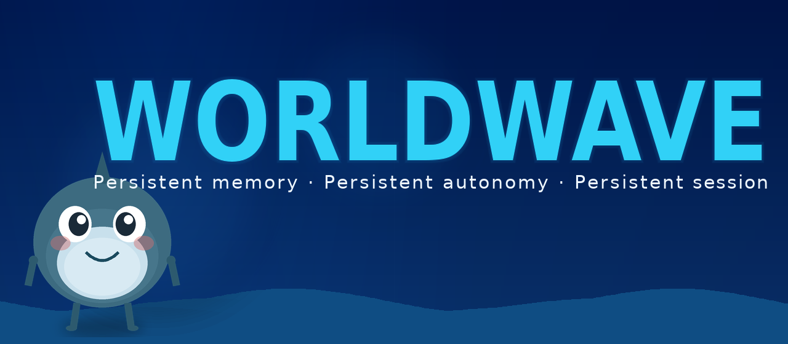

<p align="center">
  <br>
  
  <br>
</p>

<p align="center">
  <a href="https://github.com/Clean-Dust/worldwave/actions/workflows/ci.yml?branch=main"></a>
  <a href="https://www.python.org/downloads/"></a>
  <a href="https://github.com/Clean-Dust/worldwave/blob/main/LICENSE"></a>
  <a href="#quick-install"></a>
  <a href="#english"></a>
  <a href="#chinese"></a>
</p>

<p align="center">
  <a href="#english">English</a> &nbsp;|&nbsp;
  <a href="#chinese">简体中文</a>
</p>

---

<h2 id="english">Worldwave</h2>

**Persistent memory · Persistent autonomy · Persistent session**

### Quick Install

Linux, macOS, WSL2 (Python 3.10+):

```bash
bash <(curl -fsSL https://raw.githubusercontent.com/Clean-Dust/worldwave/main/deploy.sh)
```

One line. The installer asks for an LLM API key (DeepSeek · OpenAI · Anthropic · OpenRouter), then you chat — **install → key → talk**.

<details>
<summary><b>Advanced — manual install, server mode, platforms, extras</b></summary>

**Manual install**

```bash
git clone https://github.com/Clean-Dust/worldwave.git
cd worldwave
pip install -e .
cp .env.example .env   # set any provider key (see .env.example)
ww run "Hello, what can you do?"
```

**Change / set key later** (if install skipped the prompt): `ww key set <key> [deepseek|openai|anthropic|openrouter]`

**Server mode** (API + Web UI + Telegram gateway)

```bash
python server.py
# API:      http://localhost:9300
# Web UI:   http://localhost:9300/ww/webui/
# API docs: http://localhost:9300/docs
# Telegram: set TELEGRAM_WW_TOKEN in .env, restart
```

**Hardware:** Python 3.10+, ~512 MB RAM idle, ~2 GB under load. No GPU required.

| Platform | Status | Notes |
|----------|--------|-------|
| Linux (x86_64) | Full | Primary. Ubuntu 22.04+, Debian 12+ |
| macOS (Apple Silicon) | Supported | `pip install -e .` works; browser extras need `playwright install` |
| Windows (WSL2) | Supported | Run the one-liner inside WSL2 |
| Windows (native) | Partial | `pip install -e .` works; some tools degraded |

**Optional extras**

```bash
pip install -e ".[browser]"   # Playwright
pip install -e ".[nats]"      # NATS JetStream
pip install -e ".[stt]"       # Whisper STT
pip install -e ".[test]"      # pytest
pip install -e ".[all]"       # everything
```

</details>


### What makes this different

| Existing approach | Worldwave |
|---|---|
| **Session-based** — state dies with the process | **Entity-based** — state persists across restarts, platforms, and time |
| **Passive memory** — agent receives RAG results, cannot edit what it knows | **Self-editing memory** — agent calls `remember()` / `forget()` to manage its own knowledge base |
| **Single-platform** — Telegram bot ≠ terminal agent | **Cross-platform identity** — all platforms resolve to the same `entity_id`, sharing one timeline |
| **Stateless worker** — each request spawns a fresh context | **State machine** — auto-hydrates on message, auto-persists on idle, sleeps when unused |
| **Flat vector search** — facts conflict with no time dimension | **Temporal knowledge graph** — facts have `valid_from`/`valid_until`/`superseded_by`; outdated facts are superseded, not deleted |
| **External graph DB** (Neo4j) required for multi-hop reasoning | **SQLite CTE** recursive queries for typed edge traversal — zero extra dependencies |

Currently serving 13 messaging platforms and 195 tools across 16 categories. Includes a **decentralized federated-learning stack** (P2P discovery, gossip, model-weight exchange with provenance) — **shipped in-tree, optional, off by default; not open for public beta yet**.

<p align="center">
  <img src="data:image/svg+xml;base64,PHN2ZyB4bWxucz0iaHR0cDovL3d3dy53My5vcmcvMjAwMC9zdmciIHdpZHRoPSI3MjAiIGhlaWdodD0iNTYwIiB2aWV3Qm94PSIwIDAgNzIwIDU2MCI+PHJlY3Qgd2lkdGg9IjcyMCIgaGVpZ2h0PSI1NjAiIGZpbGw9IiMxYTFhMmUiIHJ4PSI4Ii8+PHRleHQgeD0iMzYwIiB5PSIzMCIgZmlsbD0iIzg4ODhhYSIgZm9udC1mYW1pbHk9Im1vbm9zcGFjZSIgZm9udC1zaXplPSIxMyIgdGV4dC1hbmNob3I9Im1pZGRsZSI+V09STERXQVZFIEFSQ0hJVEVDVFVSRTwvdGV4dD48IS0tIFBsYXRmb3JtIExheWVyIC0tPjxyZWN0IHg9IjYwIiB5PSI0NSIgd2lkdGg9IjYwMCIgaGVpZ2h0PSI2MCIgZmlsbD0iIzJkMmQzYSIgc3Ryb2tlPSIjNDg0ODU4IiBzdHJva2Utd2lkdGg9IjEiIHJ4PSI0Ii8+PHRleHQgeD0iMzYwIiB5PSI2NSIgZmlsbD0iI2NjY2NkZCIgZm9udC1mYW1pbHk9Im1vbm9zcGFjZSIgZm9udC1zaXplPSIxMiIgdGV4dC1hbmNob3I9Im1pZGRsZSI+UGxhdGZvcm0gTGF5ZXI8L3RleHQ+PHRleHQgeD0iMzYwIiB5PSI4NSIgZmlsbD0iIzc3NzdhYSIgZm9udC1mYW1pbHk9Im1vbm9zcGFjZSIgZm9udC1zaXplPSIxMCIgdGV4dC1hbmNob3I9Im1pZGRsZSI+VGVybWluYWwgfCBUZWxlZ3JhbSB8IEhUVFAgfCBEaXNjb3JkIHwgRmVpc2h1IHwgU2xhY2sgfCBTaWduYWwgfCBXZUNoYXQgfCA4IG1vcmU8L3RleHQ+PCEtLSBBcnJvdyBQbGF0Zm9ybSAtPiBJZGVudGl0eSAtLT48bGluZSB4MT0iMzYwIiB5MT0iMTA1IiB4Mj0iMzYwIiB5Mj0iMTMwIiBzdHJva2U9IiM2MGE1ZmEiIHN0cm9rZS13aWR0aD0iMiIvPjxwb2x5Z29uIHBvaW50cz0iMzU1LDEyNSAzNjAsMTM1IDM2NSwxMjUiIGZpbGw9IiM2MGE1ZmEiLz48IS0tIElkZW50aXR5IFJlc29sdmVyIC0tPjxyZWN0IHg9IjE2MCIgeT0iMTM1IiB3aWR0aD0iNDAwIiBoZWlnaHQ9IjU1IiBmaWxsPSIjMmQyZDNhIiBzdHJva2U9IiM2MGE1ZmEiIHN0cm9rZS13aWR0aD0iMSIgcng9IjQiLz48dGV4dCB4PSIzNjAiIHk9IjE1NSIgZmlsbD0iIzYwYTVmYSIgZm9udC1mYW1pbHk9Im1vbm9zcGFjZSIgZm9udC1zaXplPSIxMiIgdGV4dC1hbmNob3I9Im1pZGRsZSI+SWRlbnRpdHlSZXNvbHZlcjwvdGV4dD48dGV4dCB4PSIzNjAiIHk9IjE3NSIgZmlsbD0iIzc3NzdhYSIgZm9udC1mYW1pbHk9Im1vbm9zcGFjZSIgZm9udC1zaXplPSIxMCIgdGV4dC1hbmNob3I9Im1pZGRsZSI+YWxsIHBsYXRmb3JtIElEcyDihpIgc2luZ2xlIGVudGl0eV9pZCAoU1FMaXRlLCBhdXRvLWNyZWF0ZSk8L3RleHQ+PCEtLSBBcnJvdyBJZGVudGl0eSAtPiBFbnRpdHkgU3RhdGUgLS0+PGxpbmUgeDE9IjM2MCIgeTE9IjE5MCIgeDI9IjM2MCIgeTI9IjIxNSIgc3Ryb2tlPSIjZmZiYjMzIiBzdHJva2Utd2lkdGg9IjIiLz48cG9seWdvbiBwb2ludHM9IjM1NSwyMTAgMzYwLDIyMCAzNjUsMjEwIiBmaWxsPSIjZmZiYjMzIi8+PCEtLSBFbnRpdHkgU3RhdGUgTWFjaGluZSAtLT48cmVjdCB4PSIxNDAiIHk9IjIyMCIgd2lkdGg9IjQ0MCIgaGVpZ2h0PSI4NSIgZmlsbD0iIzJkMmQzYSIgc3Ryb2tlPSIjZmZiYjMzIiBzdHJva2Utd2lkdGg9IjEiIHJ4PSI0Ii8+PHRleHQgeD0iMzYwIiB5PSIyNDAiIGZpbGw9IiNmZmJiMzMiIGZvbnQtZmFtaWx5PSJtb25vc3BhY2UiIGZvbnQtc2l6ZT0iMTIiIHRleHQtYW5jaG9yPSJtaWRkbGUiPkVudGl0eSBTdGF0ZSBNYWNoaW5lPC90ZXh0PjxyZWN0IHg9IjE1NSIgeT0iMjUwIiB3aWR0aD0iNDEwIiBoZWlnaHQ9IjQ1IiBmaWxsPSIjMWEyYjNhIiByeD0iMyIvPjx0ZXh0IHg9IjE2NSIgeT0iMjY2IiBmaWxsPSIjYWFhYWJiIiBmb250LWZhbWlseT0ibW9ub3NwYWNlIiBmb250LXNpemU9IjEwIj53b3JraW5nX21lbW9yeSAoYWdlbnQgY2FuIHNlbGYtZWRpdCkgfCBwcmVmZXJlbmNlczwvdGV4dD48dGV4dCB4PSIxNjUiIHk9IjI4NCIgZmlsbD0iI2FhYWFiYiIgZm9udC1mYW1pbHk9Im1vbm9zcGFjZSIgZm9udC1zaXplPSIxMCI+bGFzdF9jb250ZXh0IHwgYWN0aXZlX2dvYWwgfCBoeWRyYXRlIOKGkiBwZXJzaXN0IOKGkiBzbGVlcDwvdGV4dD48IS0tIEFycm93IEVudGl0eSAtPiBTcGlyYWwgLS0+PGxpbmUgeDE9IjM2MCIgeTE9IjMwNSIgeDI9IjM2MCIgeTI9IjMzMCIgc3Ryb2tlPSIjZmY2YjZiIiBzdHJva2Utd2lkdGg9IjIiLz48cG9seWdvbiBwb2ludHM9IjM1NSwzMjUgMzYwLDMzNSAzNjUsMzI1IiBmaWxsPSIjZmY2YjZiIi8+PCEtLSBTcGlyYWwgTG9vcCAtLT48cmVjdCB4PSIxMDAiIHk9IjMzNSIgd2lkdGg9IjUyMCIgaGVpZ2h0PSI4MCIgZmlsbD0iIzJkMmQzYSIgc3Ryb2tlPSIjZmY2YjZiIiBzdHJva2Utd2lkdGg9IjEiIHJ4PSI0Ii8+PHRleHQgeD0iMzYwIiB5PSIzNTUiIGZpbGw9IiNmZjZiNmIiIGZvbnQtZmFtaWx5PSJtb25vc3BhY2UiIGZvbnQtc2l6ZT0iMTIiIHRleHQtYW5jaG9yPSJtaWRkbGUiPlNwaXJhbCBDb2duaXRpdmUgTG9vcCAoNyBwaGFzZSwgTExNLWRyaXZlbik8L3RleHQ+PHRleHQgeD0iMzYwIiB5PSIzNzgiIGZpbGw9IiNjY2NjZGQiIGZvbnQtZmFtaWx5PSJtb25vc3BhY2UiIGZvbnQtc2l6ZT0iMTAiIHRleHQtYW5jaG9yPSJtaWRkbGUiPlBFUkNFSVZFIOKGkiBSRUNBTEwg4oaSIFBMQU4g4oaSIEFDVCDihpIgRVZBTFVBVEUg4oaSIExFQVJOIOKGkiBDT05TT0xJREFURTwvdGV4dD48dGV4dCB4PSIzNjAiIHk9IjM5OCIgZmlsbD0iIzc3NzdhYSIgZm9udC1mYW1pbHk9Im1vbm9zcGFjZSIgZm9udC1zaXplPSI5IiB0ZXh0LWFuY2hvcj0ibWlkZGxlIj5lYWNoIHBoYXNlIGNoZWNrcG9pbnRlZCBmb3IgY3Jhc2ggcmVjb3ZlcnkgfCBhdXRvLWluamVjdHMgZW50aXR5IGNvbnRleHQ8L3RleHQ+PCEtLSBBcnJvd3MgdG8gc3Vic3lzdGVtcyAtLT48bGluZSB4MT0iMzYwIiB5MT0iNDE1IiB4Mj0iMzYwIiB5Mj0iNDM1IiBzdHJva2U9IiM0ODQ4NTgiIHN0cm9rZS13aWR0aD0iMiIvPjwhLS0gU3Vic3lzdGVtcyAtLT48cmVjdCB4PSI0MCIgeT0iNDQwIiB3aWR0aD0iMTIwIiBoZWlnaHQ9IjY1IiBmaWxsPSIjMmQyZDNhIiBzdHJva2U9IiM0ODQ4NTgiIHN0cm9rZS13aWR0aD0iMSIgcng9IjQiLz48dGV4dCB4PSIxMDAiIHk9IjQ2MCIgZmlsbD0iI2NjY2NkZCIgZm9udC1mYW1pbHk9Im1vbm9zcGFjZSIgZm9udC1zaXplPSIxMSIgdGV4dC1hbmNob3I9Im1pZGRsZSI+TWVtb3J5PC90ZXh0Pjx0ZXh0IHg9IjEwMCIgeT0iNDc4IiBmaWxsPSIjNzc3N2FhIiBmb250LWZhbWlseT0ibW9ub3NwYWNlIiBmb250LXNpemU9IjkiIHRleHQtYW5jaG9yPSJtaWRkbGUiPjggbGF5ZXJzPC90ZXh0Pjx0ZXh0IHg9IjEwMCIgeT0iNDk0IiBmaWxsPSIjNzc3N2FhIiBmb250LWZhbWlseT0ibW9ub3NwYWNlIiBmb250LXNpemU9IjkiIHRleHQtYW5jaG9yPSJtaWRkbGUiPnRlbXBvcmFsIEtHPC90ZXh0PjxyZWN0IHg9IjE3NSIgd2lkdGg9IjEyMCIgaGVpZ2h0PSI2NSIgeT0iNDQwIiBmaWxsPSIjMmQyZDNhIiBzdHJva2U9IiM0ODQ4NTgiIHN0cm9rZS13aWR0aD0iMSIgcng9IjQiLz48dGV4dCB4PSIyMzUiIHk9IjQ2MCIgZmlsbD0iI2NjY2NkZCIgZm9udC1mYW1pbHk9Im1vbm9zcGFjZSIgZm9udC1zaXplPSIxMSIgdGV4dC1hbmNob3I9Im1pZGRsZSI+VG9vbHM8L3RleHQ+PHRleHQgeD0iMjM1IiB5PSI0NzgiIGZpbGw9IiM3Nzc3YWEiIGZvbnQtZmFtaWx5PSJtb25vc3BhY2UiIGZvbnQtc2l6ZT0iOSIgdGV4dC1hbmNob3I9Im1pZGRsZSI+MTkyIHRvb2xzPC90ZXh0Pjx0ZXh0IHg9IjIzNSIgeT0iNDk0IiBmaWxsPSIjNzc3N2FhIiBmb250LWZhbWlseT0ibW9ub3NwYWNlIiBmb250LXNpemU9IjkiIHRleHQtYW5jaG9yPSJtaWRkbGUiPjE2IGNhdGVnb3JpZXM8L3RleHQ+PHJlY3QgeD0iMzEwIiB3aWR0aD0iMTIwIiBoZWlnaHQ9IjY1IiB5PSI0NDAiIGZpbGw9IiMyZDJkM2EiIHN0cm9rZT0iIzQ4NDg1OCIgc3Ryb2tlLXdpZHRoPSIxIiByeD0iNCIvPjx0ZXh0IHg9IjM3MCIgeT0iNDYwIiBmaWxsPSIjY2NjY2RkIiBmb250LWZhbWlseT0ibW9ub3NwYWNlIiBmb250LXNpemU9IjExIiB0ZXh0LWFuY2hvcj0ibWlkZGxlIj5TdWJjb25zY2lvdXM8L3RleHQ+PHRleHQgeD0iMzcwIiB5PSI0NzgiIGZpbGw9IiM3Nzc3YWEiIGZvbnQtZmFtaWx5PSJtb25vc3BhY2UiIGZvbnQtc2l6ZT0iOSIgdGV4dC1hbmNob3I9Im1pZGRsZSI+bG9jYWwgTUw8L3RleHQ+PHRleHQgeD0iMzcwIiB5PSI0OTQiIGZpbGw9IiM3Nzc3YWEiIGZvbnQtZmFtaWx5PSJtb25vc3BhY2UiIGZvbnQtc2l6ZT0iOSIgdGV4dC1hbmNob3I9Im1pZGRsZSI+NzAwIEtCIE5OPC90ZXh0PjxyZWN0IHg9IjQ0NSIgd2lkdGg9IjEyMCIgaGVpZ2h0PSI2NSIgeT0iNDQwIiBmaWxsPSIjMmQyZDNhIiBzdHJva2U9IiM0ODQ4NTgiIHN0cm9rZS13aWR0aD0iMSIgcng9IjQiLz48dGV4dCB4PSI1MDUiIHk9IjQ2MCIgZmlsbD0iI2NjY2NkZCIgZm9udC1mYW1pbHk9Im1vbm9zcGFjZSIgZm9udC1zaXplPSIxMSIgdGV4dC1hbmNob3I9Im1pZGRsZSI+UDJQPC90ZXh0Pjx0ZXh0IHg9IjUwNSIgeT0iNDc4IiBmaWxsPSIjNzc3N2FhIiBmb250LWZhbWlseT0ibW9ub3NwYWNlIiBmb250LXNpemU9IjkiIHRleHQtYW5jaG9yPSJtaWRkbGUiPmdvc3NpcDwvdGV4dD48dGV4dCB4PSI1MDUiIHk9IjQ5NCIgZmlsbD0iIzc3NzdhYSIgZm9udC1mYW1pbHk9Im1vbm9zcGFjZSIgZm9udC1zaXplPSI5IiB0ZXh0LWFuY2hvcj0ibWlkZGxlIj5NZXJrbGUgY2hhaW48L3RleHQ+PHJlY3QgeD0iNTgwIiB3aWR0aD0iMTAwIiBoZWlnaHQ9IjY1IiB5PSI0NDAiIGZpbGw9IiMyZDJkM2EiIHN0cm9rZT0iIzQ4NDg1OCIgc3Ryb2tlLXdpZHRoPSIxIiByeD0iNCIvPjx0ZXh0IHg9IjYzMCIgeT0iNDYwIiBmaWxsPSIjY2NjY2RkIiBmb250LWZhbWlseT0ibW9ub3NwYWNlIiBmb250LXNpemU9IjExIiB0ZXh0LWFuY2hvcj0ibWlkZGxlIj5Db2Rpbmc8L3RleHQ+PHRleHQgeD0iNjMwIiB5PSI0NzgiIGZpbGw9IiM3Nzc3YWEiIGZvbnQtZmFtaWx5PSJtb25vc3BhY2UiIGZvbnQtc2l6ZT0iOSIgdGV4dC1hbmNob3I9Im1pZGRsZSI+ZGVmZW5zaXZlPC90ZXh0Pjx0ZXh0IHg9IjYzMCIgeT0iNDk0IiBmaWxsPSIjNzc3N2FhIiBmb250LWZhbWlseT0ibW9ub3NwYWNlIiBmb250LXNpemU9IjkiIHRleHQtYW5jaG9yPSJtaWRkbGUiPmVkaXQgKyBBU1Q8L3RleHQ+PHRleHQgeD0iMzYwIiB5PSI1MzAiIGZpbGw9IiM4ODg4YWEiIGZvbnQtZmFtaWx5PSJtb25vc3BhY2UiIGZvbnQtc2l6ZT0iOSIgdGV4dC1hbmNob3I9Im1pZGRsZSI+wr0gT1MgSW50ZXJmYWNlIHwgwr0gTENMIEludGVyZmFjZSB8IMK9IEhUVFAgQVBJIHwgwr0gV2ViIFVJIHwgwr0gTXVsdGktcGxhdGZvcm0gR2F0ZXdheTwvdGV4dD48L3N2Zz4=" alt="Architecture" width="700">
</p>

### Architecture

The diagram above shows the layered architecture: Platform Layer → IdentityResolver → Entity State Machine → Spiral Cognitive Loop → subsystems.

### Demo: cross-platform continuity

```
# Terminal — start a task
$ ww run "I'm working on a Python project called 'nexus'"

  [Entity: ent_a1b2c3] Context loaded (1 prior interaction)
  Worldwave: Got it. I'll remember the project name. What's the focus area?

$ ww run "It's a CLI tool for managing Docker containers"

  Worldwave: Understood — 'nexus' is a Docker CLI tool.
  *calls remember(key='project_name', value='nexus')*
  *calls remember(key='project_focus', value='Docker CLI tool')*

# ... later, from Telegram ...
User: What was that project I mentioned earlier?

  [Entity: ent_a1b2c3] Context loaded — last interaction 8 min ago via terminal
  Worldwave: You're working on 'nexus', a CLI tool for managing Docker containers.
  You mentioned it about 8 minutes ago in the terminal. Need help with anything specific?
```

The agent remembered because `remember()` stored the facts in entity state, and entity state is loaded regardless of which platform the next message comes from.

### Feature Overview

| Category | Modules | Description |
|----------|---------|-------------|
| **Cognitive Engine** | `core/loop.py` | 7-phase spiral: perceive, recall, plan, act, evaluate, learn, consolidate |
| **Entity Continuity** | `wavegate/identity.py`, `core/entity_state.py` | Cross-platform identity resolution, persistent state with auto-hydration/sleep |
| **Memory System** | `core/memory/` (12 modules) | Hippocampus buffer, amygdala scoring, sleep consolidation, reconsolidation, recall with spreading activation, temporal validity tracking, typed knowledge graph edges with CTE multi-hop traversal |
| **Self-Editing Memory** | `core/memory/tools.py` | Agent calls `remember()` / `forget()` / `recall_mine()` to manage its own knowledge |
| **Gateway** | `gateway/` (25 modules) | Adapters for Telegram, Discord, Slack, Signal, WeChat, Feishu, DingTalk, WhatsApp, LINE, Matrix, Webhook |
| **Tools** | `tools/registry.py` | 195 tools across 16 categories: shell, file, web, browser, memory, coding, contacts, scheduling, platform messaging, MCP bridge, credentials, plugins, hooks, slash commands, voice, computer use |
| **Subconscious** | `core/subconscious/` (30 modules) | Local ML: DeepRiskNet (~700 KB), decision trees, PPO, CFR, nighttime schema induction. Reads numerical features only — never raw conversations |
| **Decentralized federated learning** | `p2p/` + `core/subconscious` federation paths | Multi-node P2P discovery (mDNS, DHT, HTTP tracker), gossip for local-model weight exchange, Merkle chain for model provenance, NAT relay, Nostr relay pool. **Built-in; optional and off by default. Not in public beta** (no public multi-node beta program yet). Mining optional, also off by default |
| **Coding Engine** | `coding/` (12+ modules) | Defensive code editing with backup/rollback, AST-aware search (ast-grep), progressive loading for large repos, capability mutex for concurrent edits |
| **Computer Use** | `core/computer_use/` (12 modules) | 7-tier progressive screen capture, UI Automation tree, set-of-mark visual grounding, browser stealth control, vision loop |
| **Biomimetic** | `core/` (45 modules) | Global workspace (7-item capacity), basal ganglia (Go/NoGo gate), circadian rhythm, cascade bus, predictive model, skill solidification, self-model introspection |
| **Multi-Agent Orchestration** ✨ | `core/delegation.py` | Breaks complex tasks into parallel subtasks and merges results. Kicks in automatically when things get complicated |
| **Skill Evolution** ✨ | `core/skill_evolution.py` | Watches how you use it, learns from successful patterns — after doing something 3+ times, turns it into a reusable skill |
| **Autonomous Scheduling** ✨ | `core/autonomous_scheduler.py` | Schedule tasks in plain English ("every 2h", "daily at 9am"). Runs a heartbeat to keep things on track, and can suggest maintenance tasks when idle |
| **Approval Gating** ✨ | `core/enterprise.py` | Per-action approval system: auto/ask/deny/sandbox modes with rate limiting, layered on RBAC |
| **Observability** ✨ | `core/tracing.py` | Per-phase spiral tracing with p50/p95 latency, bottleneck analysis, error correlation, JSONL export |
| **User Modeling** ✨ | `core/user_model.py` | Dynamic inference of communication style, domain expertise, implicit goals — no external ML |
| **Sandbox** | `sandbox/` | Isolated execution for untrusted code |
| **CLI** | `ww_cli.py` | `ww run`, `ww chat`, `ww mascot`, `ww pairing`, `ww tools`, `ww config`, `ww deploy` |
| **Plugins** | `core/plugins.py` | Plugin marketplace: discover, install, enable/disable lifecycle |

### Design Decisions

- **Zero external ML dependencies for core.** DeepRiskNet, blockchain, P2P, memory scoring — all Python stdlib. No numpy, sklearn, or torch required.
- **Everything optional, everything off by default.** Federated learning / P2P gossip, mining, self-hosting, auto-evolution — disabled until explicitly enabled. The federation stack is real code, not a placeholder; it is **not opened as a public beta** yet.
- **No external graph database.** Knowledge graph edges use SQLite CTE recursive queries. No Neo4j, no Redis required.
- **Single execution path.** `ww run` and `ww chat` use identical code path — no dual-mode complexity.
- **Entity-first.** The framework models a persistent identity, not a disposable chat session.
- **Agent manages its own memory.** The agent calls `remember()` / `forget()` as tools — it decides what to retain, not a background heuristic.

### Working alongside Claude Code & Codex

**Claude Code and Codex** are great at what they do. But every session starts from zero — close the window, lose everything. Open a new chat, explain your project all over again.

Worldwave works **alongside** them — you don't have to choose. Keep your existing workflow. Just add Worldwave as the layer that remembers everything, coordinates across tools, and keeps the thread going.

### Contributing

Areas where help is most needed:

- **Multi-node federation validation** — decentralized federated learning is in-tree (unit-tested); help validating real multi-machine runs before any public beta
- **Windows native packaging** — currently WSL2-only; a native Windows launcher is needed
- **Gateway adapter contributions** — additional platform adapters (WhatsApp Business API, Microsoft Teams, etc.)
- **Performance profiling** — memory usage under sustained load, token budget optimization

For bug reports and feature requests, open an issue. For code contributions, please:

1. Fork the repo
2. Create a feature branch
3. Ensure `pytest tests/` passes (584 tests)
4. Open a PR with a clear description

### License

MIT — see [LICENSE](LICENSE).

<br>

<p align="center">
  <b>Like the idea of a persistent cognitive entity?</b><br>
  <a href="https://github.com/Clean-Dust/worldwave">⭐ Star the repo</a> &nbsp;·&nbsp;
  <a href="https://github.com/Clean-Dust/worldwave/issues">🐛 Report a bug</a> &nbsp;·&nbsp;
  <a href="https://github.com/Clean-Dust/worldwave/fork">🍴 Fork & contribute</a>
</p>

---

<h2 id="chinese">Worldwave · 简体中文</h2>

**恒久记忆 · 恒久自主 · 恒久 Session**

### 快速安装

Linux、macOS、WSL2（Python 3.10+）：

```bash
bash <(curl -fsSL https://raw.githubusercontent.com/Clean-Dust/worldwave/main/deploy.sh)
```

一行搞定。安装时会要 LLM API key（DeepSeek · OpenAI · Anthropic · OpenRouter），然后直接聊天 — **安装 → key → 聊天**。

<details>
<summary><b>高级 — 手动安装、服务器模式、平台与可选依赖</b></summary>

**手动安装**

```bash
git clone https://github.com/Clean-Dust/worldwave.git
cd worldwave
pip install -e .
cp .env.example .env   # 写入任意厂商 LLM key（见 .env.example）
ww run "你好，你能做什么？"
```

**之后改 / 补 key**（安装时跳过提示时）：`ww key set <key> [deepseek|openai|anthropic|openrouter]`

**服务器模式**（API + Web UI + Telegram 网关）

```bash
python server.py
# API:      http://localhost:9300
# Web UI:   http://localhost:9300/ww/webui/
# API 文档: http://localhost:9300/docs
# Telegram: .env 设 TELEGRAM_WW_TOKEN 后重启
```

**硬件：** Python 3.10+，空闲约 512 MB，负载约 2 GB。不需要 GPU。

| 平台 | 状态 | 备注 |
|------|------|------|
| Linux (x86_64) | 完整 | 主目标。Ubuntu 22.04+、Debian 12+ |
| macOS (Apple Silicon) | 支持 | `pip install -e .` 可用；browser 扩展需 `playwright install` |
| Windows (WSL2) | 支持 | 在 WSL2 内跑上面一行安装 |
| Windows (原生) | 部分 | `pip install -e .` 可用；部分工具能力降级 |

**可选依赖**

```bash
pip install -e ".[browser]"   # Playwright
pip install -e ".[nats]"      # NATS JetStream
pip install -e ".[stt]"       # Whisper 语音
pip install -e ".[test]"      # pytest
pip install -e ".[all]"       # 全部
```

</details>


### 为什么不同

| 现有方案 | Worldwave |
|---|---|
| **基于会话** — 进程结束，状态消失 | **基于实体** — 状态跨重启、跨平台、跨时间持久存在 |
| **被动记忆** — 代理接收 RAG 结果，无法编辑所知 | **自主编辑记忆** — 代理调用 `remember()` / `forget()` 管理自己的知识库 |
| **单平台** — Telegram bot ≠ 终端代理 | **跨平台统一身份** — 所有平台解析为同一 `entity_id`，共享单条时间线 |
| **无状态 worker** — 每次请求重新构建上下文 | **状态机** — 收到消息自动唤醒载入，空闲自动持久化休眠 |
| **扁平向量搜索** — 事实冲突，无时间维度 | **时态知识图谱** — 事实有 `valid_from`/`valid_until`/`superseded_by`；过时事实标记取代而非删除 |
| **需要外部图数据库**（Neo4j）进行多跳推理 | **SQLite CTE** 递归查询实现类型化边遍历 — 零额外依赖 |

目前已接入 13 个即时通讯平台、195 个工具覆盖 16 个类别。仓库内含**去中心化联邦学习**栈（P2P 发现、gossip、带溯源的模型权重交换）——**代码已有、可选、默认关闭；尚未公测**。

<p align="center">
  <img src="data:image/svg+xml;base64,PHN2ZyB4bWxucz0iaHR0cDovL3d3dy53My5vcmcvMjAwMC9zdmciIHdpZHRoPSI3MjAiIGhlaWdodD0iNTYwIiB2aWV3Qm94PSIwIDAgNzIwIDU2MCI+PHJlY3Qgd2lkdGg9IjcyMCIgaGVpZ2h0PSI1NjAiIGZpbGw9IiMxYTFhMmUiIHJ4PSI4Ii8+PHRleHQgeD0iMzYwIiB5PSIzMCIgZmlsbD0iIzg4ODhhYSIgZm9udC1mYW1pbHk9Im1vbm9zcGFjZSIgZm9udC1zaXplPSIxMyIgdGV4dC1hbmNob3I9Im1pZGRsZSI+V09STERXQVZFIEFSQ0hJVEVDVFVSRTwvdGV4dD48IS0tIFBsYXRmb3JtIExheWVyIC0tPjxyZWN0IHg9IjYwIiB5PSI0NSIgd2lkdGg9IjYwMCIgaGVpZ2h0PSI2MCIgZmlsbD0iIzJkMmQzYSIgc3Ryb2tlPSIjNDg0ODU4IiBzdHJva2Utd2lkdGg9IjEiIHJ4PSI0Ii8+PHRleHQgeD0iMzYwIiB5PSI2NSIgZmlsbD0iI2NjY2NkZCIgZm9udC1mYW1pbHk9Im1vbm9zcGFjZSIgZm9udC1zaXplPSIxMiIgdGV4dC1hbmNob3I9Im1pZGRsZSI+UGxhdGZvcm0gTGF5ZXI8L3RleHQ+PHRleHQgeD0iMzYwIiB5PSI4NSIgZmlsbD0iIzc3NzdhYSIgZm9udC1mYW1pbHk9Im1vbm9zcGFjZSIgZm9udC1zaXplPSIxMCIgdGV4dC1hbmNob3I9Im1pZGRsZSI+VGVybWluYWwgfCBUZWxlZ3JhbSB8IEhUVFAgfCBEaXNjb3JkIHwgRmVpc2h1IHwgU2xhY2sgfCBTaWduYWwgfCBXZUNoYXQgfCA4IG1vcmU8L3RleHQ+PCEtLSBBcnJvdyBQbGF0Zm9ybSAtPiBJZGVudGl0eSAtLT48bGluZSB4MT0iMzYwIiB5MT0iMTA1IiB4Mj0iMzYwIiB5Mj0iMTMwIiBzdHJva2U9IiM2MGE1ZmEiIHN0cm9rZS13aWR0aD0iMiIvPjxwb2x5Z29uIHBvaW50cz0iMzU1LDEyNSAzNjAsMTM1IDM2NSwxMjUiIGZpbGw9IiM2MGE1ZmEiLz48IS0tIElkZW50aXR5IFJlc29sdmVyIC0tPjxyZWN0IHg9IjE2MCIgeT0iMTM1IiB3aWR0aD0iNDAwIiBoZWlnaHQ9IjU1IiBmaWxsPSIjMmQyZDNhIiBzdHJva2U9IiM2MGE1ZmEiIHN0cm9rZS13aWR0aD0iMSIgcng9IjQiLz48dGV4dCB4PSIzNjAiIHk9IjE1NSIgZmlsbD0iIzYwYTVmYSIgZm9udC1mYW1pbHk9Im1vbm9zcGFjZSIgZm9udC1zaXplPSIxMiIgdGV4dC1hbmNob3I9Im1pZGRsZSI+SWRlbnRpdHlSZXNvbHZlcjwvdGV4dD48dGV4dCB4PSIzNjAiIHk9IjE3NSIgZmlsbD0iIzc3NzdhYSIgZm9udC1mYW1pbHk9Im1vbm9zcGFjZSIgZm9udC1zaXplPSIxMCIgdGV4dC1hbmNob3I9Im1pZGRsZSI+YWxsIHBsYXRmb3JtIElEcyDihpIgc2luZ2xlIGVudGl0eV9pZCAoU1FMaXRlLCBhdXRvLWNyZWF0ZSk8L3RleHQ+PCEtLSBBcnJvdyBJZGVudGl0eSAtPiBFbnRpdHkgU3RhdGUgLS0+PGxpbmUgeDE9IjM2MCIgeTE9IjE5MCIgeDI9IjM2MCIgeTI9IjIxNSIgc3Ryb2tlPSIjZmZiYjMzIiBzdHJva2Utd2lkdGg9IjIiLz48cG9seWdvbiBwb2ludHM9IjM1NSwyMTAgMzYwLDIyMCAzNjUsMjEwIiBmaWxsPSIjZmZiYjMzIi8+PCEtLSBFbnRpdHkgU3RhdGUgTWFjaGluZSAtLT48cmVjdCB4PSIxNDAiIHk9IjIyMCIgd2lkdGg9IjQ0MCIgaGVpZ2h0PSI4NSIgZmlsbD0iIzJkMmQzYSIgc3Ryb2tlPSIjZmZiYjMzIiBzdHJva2Utd2lkdGg9IjEiIHJ4PSI0Ii8+PHRleHQgeD0iMzYwIiB5PSIyNDAiIGZpbGw9IiNmZmJiMzMiIGZvbnQtZmFtaWx5PSJtb25vc3BhY2UiIGZvbnQtc2l6ZT0iMTIiIHRleHQtYW5jaG9yPSJtaWRkbGUiPkVudGl0eSBTdGF0ZSBNYWNoaW5lPC90ZXh0PjxyZWN0IHg9IjE1NSIgeT0iMjUwIiB3aWR0aD0iNDEwIiBoZWlnaHQ9IjQ1IiBmaWxsPSIjMWEyYjNhIiByeD0iMyIvPjx0ZXh0IHg9IjE2NSIgeT0iMjY2IiBmaWxsPSIjYWFhYWJiIiBmb250LWZhbWlseT0ibW9ub3NwYWNlIiBmb250LXNpemU9IjEwIj53b3JraW5nX21lbW9yeSAoYWdlbnQgY2FuIHNlbGYtZWRpdCkgfCBwcmVmZXJlbmNlczwvdGV4dD48dGV4dCB4PSIxNjUiIHk9IjI4NCIgZmlsbD0iI2FhYWFiYiIgZm9udC1mYW1pbHk9Im1vbm9zcGFjZSIgZm9udC1zaXplPSIxMCI+bGFzdF9jb250ZXh0IHwgYWN0aXZlX2dvYWwgfCBoeWRyYXRlIOKGkiBwZXJzaXN0IOKGkiBzbGVlcDwvdGV4dD48IS0tIEFycm93IEVudGl0eSAtPiBTcGlyYWwgLS0+PGxpbmUgeDE9IjM2MCIgeTE9IjMwNSIgeDI9IjM2MCIgeTI9IjMzMCIgc3Ryb2tlPSIjZmY2YjZiIiBzdHJva2Utd2lkdGg9IjIiLz48cG9seWdvbiBwb2ludHM9IjM1NSwzMjUgMzYwLDMzNSAzNjUsMzI1IiBmaWxsPSIjZmY2YjZiIi8+PCEtLSBTcGlyYWwgTG9vcCAtLT48cmVjdCB4PSIxMDAiIHk9IjMzNSIgd2lkdGg9IjUyMCIgaGVpZ2h0PSI4MCIgZmlsbD0iIzJkMmQzYSIgc3Ryb2tlPSIjZmY2YjZiIiBzdHJva2Utd2lkdGg9IjEiIHJ4PSI0Ii8+PHRleHQgeD0iMzYwIiB5PSIzNTUiIGZpbGw9IiNmZjZiNmIiIGZvbnQtZmFtaWx5PSJtb25vc3BhY2UiIGZvbnQtc2l6ZT0iMTIiIHRleHQtYW5jaG9yPSJtaWRkbGUiPlNwaXJhbCBDb2duaXRpdmUgTG9vcCAoNyBwaGFzZSwgTExNLWRyaXZlbik8L3RleHQ+PHRleHQgeD0iMzYwIiB5PSIzNzgiIGZpbGw9IiNjY2NjZGQiIGZvbnQtZmFtaWx5PSJtb25vc3BhY2UiIGZvbnQtc2l6ZT0iMTAiIHRleHQtYW5jaG9yPSJtaWRkbGUiPlBFUkNFSVZFIOKGkiBSRUNBTEwg4oaSIFBMQU4g4oaSIEFDVCDihpIgRVZBTFVBVEUg4oaSIExFQVJOIOKGkiBDT05TT0xJREFURTwvdGV4dD48dGV4dCB4PSIzNjAiIHk9IjM5OCIgZmlsbD0iIzc3NzdhYSIgZm9udC1mYW1pbHk9Im1vbm9zcGFjZSIgZm9udC1zaXplPSI5IiB0ZXh0LWFuY2hvcj0ibWlkZGxlIj5lYWNoIHBoYXNlIGNoZWNrcG9pbnRlZCBmb3IgY3Jhc2ggcmVjb3ZlcnkgfCBhdXRvLWluamVjdHMgZW50aXR5IGNvbnRleHQ8L3RleHQ+PCEtLSBBcnJvd3MgdG8gc3Vic3lzdGVtcyAtLT48bGluZSB4MT0iMzYwIiB5MT0iNDE1IiB4Mj0iMzYwIiB5Mj0iNDM1IiBzdHJva2U9IiM0ODQ4NTgiIHN0cm9rZS13aWR0aD0iMiIvPjwhLS0gU3Vic3lzdGVtcyAtLT48cmVjdCB4PSI0MCIgeT0iNDQwIiB3aWR0aD0iMTIwIiBoZWlnaHQ9IjY1IiBmaWxsPSIjMmQyZDNhIiBzdHJva2U9IiM0ODQ4NTgiIHN0cm9rZS13aWR0aD0iMSIgcng9IjQiLz48dGV4dCB4PSIxMDAiIHk9IjQ2MCIgZmlsbD0iI2NjY2NkZCIgZm9udC1mYW1pbHk9Im1vbm9zcGFjZSIgZm9udC1zaXplPSIxMSIgdGV4dC1hbmNob3I9Im1pZGRsZSI+TWVtb3J5PC90ZXh0Pjx0ZXh0IHg9IjEwMCIgeT0iNDc4IiBmaWxsPSIjNzc3N2FhIiBmb250LWZhbWlseT0ibW9ub3NwYWNlIiBmb250LXNpemU9IjkiIHRleHQtYW5jaG9yPSJtaWRkbGUiPjggbGF5ZXJzPC90ZXh0Pjx0ZXh0IHg9IjEwMCIgeT0iNDk0IiBmaWxsPSIjNzc3N2FhIiBmb250LWZhbWlseT0ibW9ub3NwYWNlIiBmb250LXNpemU9IjkiIHRleHQtYW5jaG9yPSJtaWRkbGUiPnRlbXBvcmFsIEtHPC90ZXh0PjxyZWN0IHg9IjE3NSIgd2lkdGg9IjEyMCIgaGVpZ2h0PSI2NSIgeT0iNDQwIiBmaWxsPSIjMmQyZDNhIiBzdHJva2U9IiM0ODQ4NTgiIHN0cm9rZS13aWR0aD0iMSIgcng9IjQiLz48dGV4dCB4PSIyMzUiIHk9IjQ2MCIgZmlsbD0iI2NjY2NkZCIgZm9udC1mYW1pbHk9Im1vbm9zcGFjZSIgZm9udC1zaXplPSIxMSIgdGV4dC1hbmNob3I9Im1pZGRsZSI+VG9vbHM8L3RleHQ+PHRleHQgeD0iMjM1IiB5PSI0NzgiIGZpbGw9IiM3Nzc3YWEiIGZvbnQtZmFtaWx5PSJtb25vc3BhY2UiIGZvbnQtc2l6ZT0iOSIgdGV4dC1hbmNob3I9Im1pZGRsZSI+MTkyIHRvb2xzPC90ZXh0Pjx0ZXh0IHg9IjIzNSIgeT0iNDk0IiBmaWxsPSIjNzc3N2FhIiBmb250LWZhbWlseT0ibW9ub3NwYWNlIiBmb250LXNpemU9IjkiIHRleHQtYW5jaG9yPSJtaWRkbGUiPjE2IGNhdGVnb3JpZXM8L3RleHQ+PHJlY3QgeD0iMzEwIiB3aWR0aD0iMTIwIiBoZWlnaHQ9IjY1IiB5PSI0NDAiIGZpbGw9IiMyZDJkM2EiIHN0cm9rZT0iIzQ4NDg1OCIgc3Ryb2tlLXdpZHRoPSIxIiByeD0iNCIvPjx0ZXh0IHg9IjM3MCIgeT0iNDYwIiBmaWxsPSIjY2NjY2RkIiBmb250LWZhbWlseT0ibW9ub3NwYWNlIiBmb250LXNpemU9IjExIiB0ZXh0LWFuY2hvcj0ibWlkZGxlIj5TdWJjb25zY2lvdXM8L3RleHQ+PHRleHQgeD0iMzcwIiB5PSI0NzgiIGZpbGw9IiM3Nzc3YWEiIGZvbnQtZmFtaWx5PSJtb25vc3BhY2UiIGZvbnQtc2l6ZT0iOSIgdGV4dC1hbmNob3I9Im1pZGRsZSI+bG9jYWwgTUw8L3RleHQ+PHRleHQgeD0iMzcwIiB5PSI0OTQiIGZpbGw9IiM3Nzc3YWEiIGZvbnQtZmFtaWx5PSJtb25vc3BhY2UiIGZvbnQtc2l6ZT0iOSIgdGV4dC1hbmNob3I9Im1pZGRsZSI+NzAwIEtCIE5OPC90ZXh0PjxyZWN0IHg9IjQ0NSIgd2lkdGg9IjEyMCIgaGVpZ2h0PSI2NSIgeT0iNDQwIiBmaWxsPSIjMmQyZDNhIiBzdHJva2U9IiM0ODQ4NTgiIHN0cm9rZS13aWR0aD0iMSIgcng9IjQiLz48dGV4dCB4PSI1MDUiIHk9IjQ2MCIgZmlsbD0iI2NjY2NkZCIgZm9udC1mYW1pbHk9Im1vbm9zcGFjZSIgZm9udC1zaXplPSIxMSIgdGV4dC1hbmNob3I9Im1pZGRsZSI+UDJQPC90ZXh0Pjx0ZXh0IHg9IjUwNSIgeT0iNDc4IiBmaWxsPSIjNzc3N2FhIiBmb250LWZhbWlseT0ibW9ub3NwYWNlIiBmb250LXNpemU9IjkiIHRleHQtYW5jaG9yPSJtaWRkbGUiPmdvc3NpcDwvdGV4dD48dGV4dCB4PSI1MDUiIHk9IjQ5NCIgZmlsbD0iIzc3NzdhYSIgZm9udC1mYW1pbHk9Im1vbm9zcGFjZSIgZm9udC1zaXplPSI5IiB0ZXh0LWFuY2hvcj0ibWlkZGxlIj5NZXJrbGUgY2hhaW48L3RleHQ+PHJlY3QgeD0iNTgwIiB3aWR0aD0iMTAwIiBoZWlnaHQ9IjY1IiB5PSI0NDAiIGZpbGw9IiMyZDJkM2EiIHN0cm9rZT0iIzQ4NDg1OCIgc3Ryb2tlLXdpZHRoPSIxIiByeD0iNCIvPjx0ZXh0IHg9IjYzMCIgeT0iNDYwIiBmaWxsPSIjY2NjY2RkIiBmb250LWZhbWlseT0ibW9ub3NwYWNlIiBmb250LXNpemU9IjExIiB0ZXh0LWFuY2hvcj0ibWlkZGxlIj5Db2Rpbmc8L3RleHQ+PHRleHQgeD0iNjMwIiB5PSI0NzgiIGZpbGw9IiM3Nzc3YWEiIGZvbnQtZmFtaWx5PSJtb25vc3BhY2UiIGZvbnQtc2l6ZT0iOSIgdGV4dC1hbmNob3I9Im1pZGRsZSI+ZGVmZW5zaXZlPC90ZXh0Pjx0ZXh0IHg9IjYzMCIgeT0iNDk0IiBmaWxsPSIjNzc3N2FhIiBmb250LWZhbWlseT0ibW9ub3NwYWNlIiBmb250LXNpemU9IjkiIHRleHQtYW5jaG9yPSJtaWRkbGUiPmVkaXQgKyBBU1Q8L3RleHQ+PHRleHQgeD0iMzYwIiB5PSI1MzAiIGZpbGw9IiM4ODg4YWEiIGZvbnQtZmFtaWx5PSJtb25vc3BhY2UiIGZvbnQtc2l6ZT0iOSIgdGV4dC1hbmNob3I9Im1pZGRsZSI+wr0gT1MgSW50ZXJmYWNlIHwgwr0gTENMIEludGVyZmFjZSB8IMK9IEhUVFAgQVBJIHwgwr0gV2ViIFVJIHwgwr0gTXVsdGktcGxhdGZvcm0gR2F0ZXdheTwvdGV4dD48L3N2Zz4=" alt="Architecture" width="700">
</p>

### 架构

上图展示了分层架构：平台层 → IdentityResolver → Entity State Machine → 螺旋认知循环 → 子系统。

### 演示：跨平台连续性

```
# 终端 — 开启一个任务
$ ww run "我在做一个叫 'nexus' 的 Python 项目"

  [Entity: ent_a1b2c3] 上下文已载入（1 次历史交互）
  Worldwave: 好的，我记住了项目名。主要做什么的？

$ ww run "是个管理 Docker 容器的 CLI 工具"

  Worldwave: 明白了 — 'nexus' 是一个 Docker CLI 工具。
  *调用 remember(key='project_name', value='nexus')*
  *调用 remember(key='project_focus', value='Docker CLI 工具')*

# ... 过了一会，从 Telegram 发消息 ...
用户: 我之前提到的那个项目叫什么来着？

  [Entity: ent_a1b2c3] 上下文已载入 — 上次交互 8 分钟前，来自终端
  Worldwave: 你在做 'nexus'，一个管理 Docker 容器的 CLI 工具。
  大约 8 分钟前在终端里提到的。需要具体帮什么吗？
```

代理之所以记得，是因为 `remember()` 将事实存入了实体状态，而实体状态在下次任何平台发来消息时都会被载入。

### 功能概览

| 类别 | 模块 | 说明 |
|------|------|------|
| **认知引擎** | `core/loop.py` | 7 阶段螺旋循环：感知、回忆、规划、行动、评估、学习、巩固 |
| **实体连续性** | `wavegate/identity.py`, `core/entity_state.py` | 跨平台身份解析，带自动休眠/唤醒的持久状态 |
| **记忆系统** | `core/memory/`（12 个模块） | 海马体缓冲、杏仁核情感评分、睡眠巩固、再巩固、扩散激活回忆、时间有效性追踪、带 CTE 多跳遍历的类型化知识图谱边 |
| **自主记忆编辑** | `core/memory/tools.py` | 代理调用 `remember()` / `forget()` / `recall_mine()` 管理自有知识 |
| **网关** | `gateway/`（25 个模块） | Telegram、Discord、Slack、Signal、微信、飞书、钉钉、WhatsApp、LINE、Matrix、Webhook 适配器 |
| **工具系统** | `tools/registry.py` | 195 个工具，16 个类别：shell、文件、网络、浏览器、记忆、编程、联系人、调度、平台消息、MCP 桥接、凭证、插件、钩子、斜杠命令、语音、桌面操作 |
| **潜意识** | `core/subconscious/`（30 个模块） | 本地 ML：DeepRiskNet（约 700 KB）、决策树、PPO、CFR、夜间模式归纳。仅读取数值特征——不读原始对话 |
| **去中心化联邦学习** | `p2p/` + `core/subconscious` 联邦路径 | 多节点 P2P 发现（mDNS、DHT、HTTP tracker）、本地模型权重 gossip 交换、Merkle 链模型溯源、NAT 中继、Nostr 中继池。**已内置；可选、默认关闭；尚未公测**（暂无公开多节点 beta）。挖矿同样可选且默认关闭 |
| **编程引擎** | `coding/`（12+ 个模块） | 带备份/回滚的防御性代码编辑、AST 感知搜索（ast-grep）、大仓库渐进式加载、并发编辑能力互斥锁 |
| **桌面操作** | `core/computer_use/`（12 个模块） | 7 层级渐进式屏幕捕获、UI Automation 树提取、标记式视觉定位、浏览器隐身控制、视觉闭环 |
| **仿生模块** | `core/`（45 个模块） | 全局工作区（7 项容量）、基底核（Go/NoGo 动作门控）、昼夜节律、级联总线、预测模型、技能固化、自我模型内省 |
| **多智能体协作** ✨ | `core/delegation.py` | 把复杂任务拆成并行子任务然后合并结果，任务复杂时自动触发 |
| **技能演化** ✨ | `core/skill_evolution.py` | 看你怎么用它，从成功模式里学——同一件事做了 3 次以上，自动变成可复用的技能 |
| **自主排程** ✨ | `core/autonomous_scheduler.py` | 自然语言定时（"每 2 小时"、"每天早上 9 点"），心跳守护进程，空闲时自动生成维护任务 |
| **审批门控** ✨ | `core/enterprise.py` | 分级审批系统：auto/ask/deny/sandbox 四模式 + 速率限制，叠加在 RBAC 之上 |
| **可观测性** ✨ | `core/tracing.py` | 每阶段计时 + p50/p95 延迟 + 瓶颈分析 + 错误关联 + JSONL 导出 |
| **用户建模** ✨ | `core/user_model.py` | 动态推断沟通风格、领域专长、隐含目标——纯统计，零外部 ML |
| **沙箱** | `sandbox/` | 不受信任代码的隔离执行环境 |
| **CLI** | `ww_cli.py` | `ww run`、`ww chat`、`ww mascot`、`ww pairing`、`ww tools`、`ww config`、`ww deploy` |
| **插件** | `core/plugins.py` | 插件市场：发现、安装、启用/禁用生命周期 |

### 设计决策

- **核心零外部 ML 依赖。** DeepRiskNet、区块链、P2P、记忆评分——全部 Python 标准库实现。不需要 numpy、sklearn、torch。
- **所有功能可选，默认关闭。** 联邦学习 / P2P gossip、挖矿、自托管、自动进化——默认禁用，需显式开启。联邦栈是真实代码，不是占位；**目前尚未作为公测开放**。
- **无外部图数据库。** 知识图谱边关系使用 SQLite CTE 递归查询。不需要 Neo4j，不需要 Redis。
- **单一执行路径。** `ww run` 与 `ww chat` 走同一代码路径——无双重模式复杂性。
- **实体优先。** 框架建模的是持久身份，而非一次性聊天线程。
- **代理自主管理记忆。** 代理通过 `remember()` / `forget()` 工具自行决定保留什么——而非背景启发式规则。

### 与 Claude Code 和 Codex 协同工作

**Claude Code 和 Codex** 本身很厉害。但它们的本质是会话——关窗口就没了，开新会话又得从头讲你的项目。

Worldwave 与它们**并肩工作**——你不用二选一。保持你现有的工作流，把 Worldwave 加进来作为那个"记住一切"的层：协调工具、守住上下文、让对话不断线。

### 参与贡献

最需要帮助的领域：

- **多节点联邦验证** — 去中心化联邦学习已在仓内（有单测）；公测前欢迎协助真实多机验证
- **Windows 原生打包** — 目前仅支持 WSL2，需要原生 Windows 启动器
- **网关适配器贡献** — 新增平台适配器（WhatsApp Business API、Microsoft Teams 等）
- **性能分析** — 持续负载下的内存使用、token 预算优化

报告 bug 或提功能请求请开 issue。贡献代码请：

1. Fork 仓库
2. 创建功能分支
3. 确保 `pytest tests/` 通过（584 个测试）
4. 提交 PR 并附清晰说明

### 许可证

MIT — 详见 [LICENSE](LICENSE)。

<br>

<p align="center">
  <b>喜欢持久认知实体这个理念？</b><br>
  <a href="https://github.com/Clean-Dust/worldwave">⭐ 给个 Star</a> &nbsp;·&nbsp;
  <a href="https://github.com/Clean-Dust/worldwave/issues">🐛 报告问题</a> &nbsp;·&nbsp;
  <a href="https://github.com/Clean-Dust/worldwave/fork">🍴 Fork 参与贡献</a>
</p>
